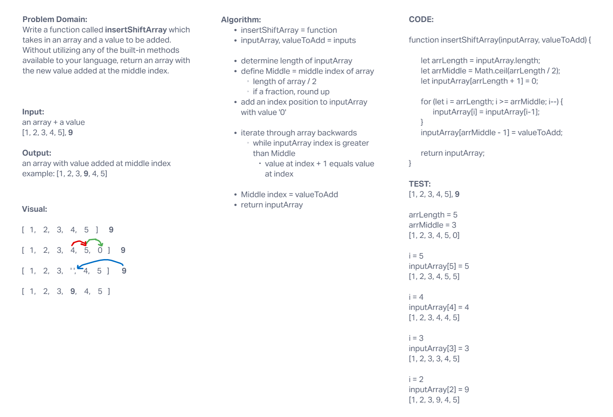

# Insert Shift Array

Write a function called `insertShiftArray` which takes in an array and a value to be added. Without utilizing any of the built-in methods available to your language, return an array with the new value added at the middle index.

## Whiteboard Process

## Approach & Efficiency

For this challenge, I decided on the following approach:

- determine the length and middle index of the input array
- add an index to the end of the array, with value of 0
- iterate through the loop (orginally I planned to iterate forwards, then thought iterating backwards might work better), reassigning the value of the following index to that of the current index
- when middle index was reached, I would assign the input value to that index - then return the array
