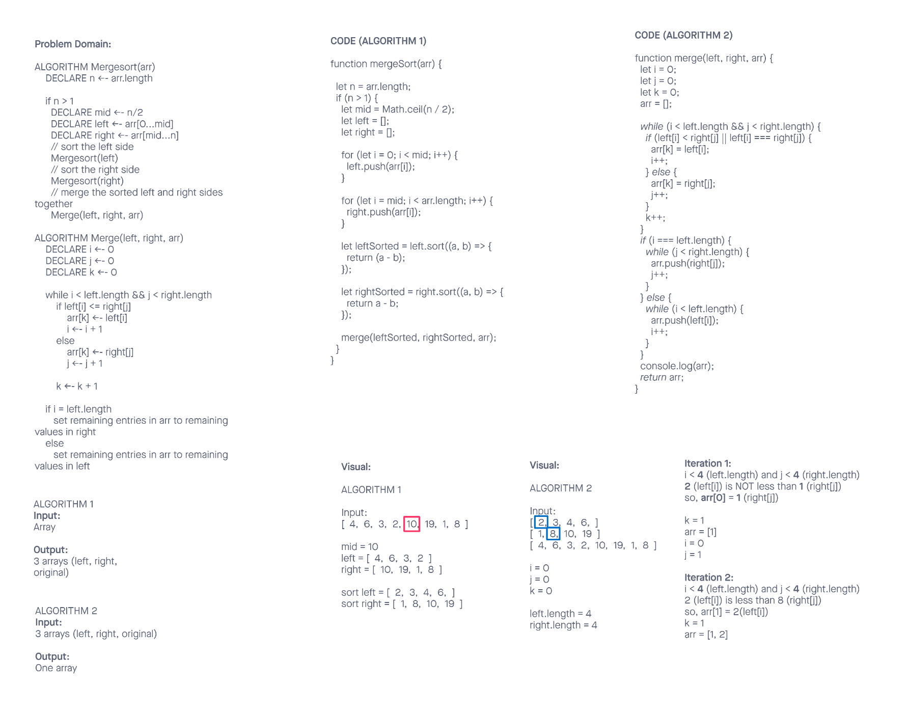
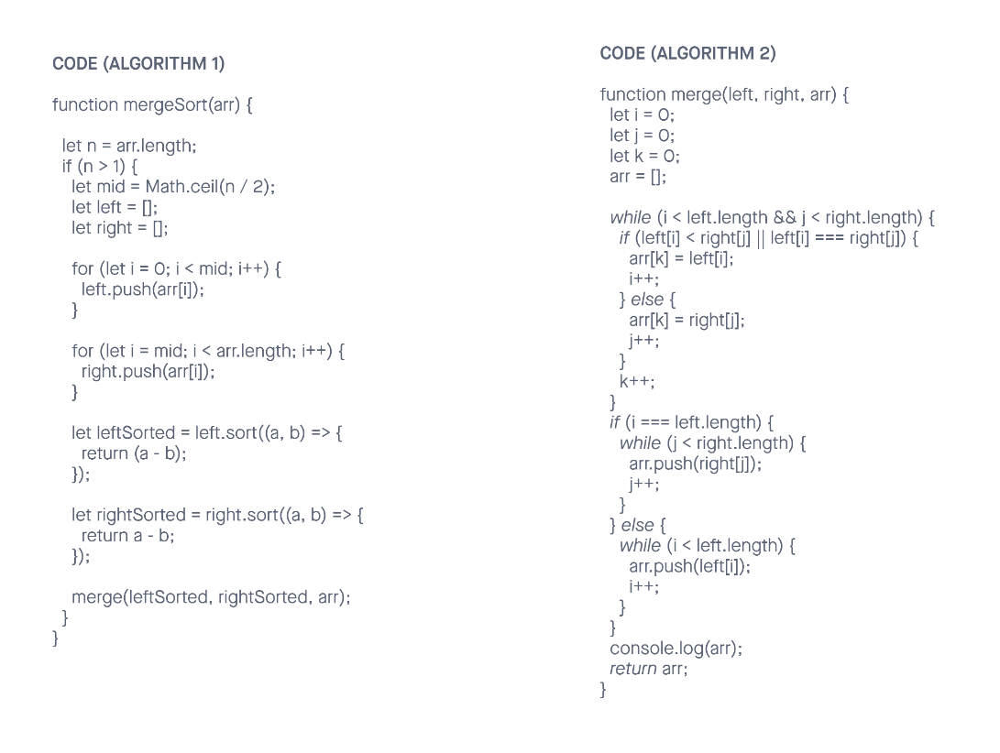

# Challenge Summary

Review the pseudocode below, then trace the algorithm by stepping through the process with the provided sample array. Document your explanation by creating a blog article that shows the step-by-step output after each iteration through some sort of visual.

Once you are done with your article, code a working, tested implementation of Merge Sort based on the pseudocode provided.

## Whiteboard Process



## Blog Article

Reading, writing, and comprehending pseudocode is an important skill for a developer to build. This skill allows a developer to work in languages they may not be as familiar with. It also helps to conceptualize the solution to a problem before jumping into the code. This slows the thought process a bit and forces the developer to think about the problem (instead of the code) first and foremost.

In the example below, we are giving some pseudocode and asked to step through the solution first. By doing this, we determine our algorithm. And once we've confirmed the algorithm is sound, we can proceed to actually writing the code.

### Problem Domain

Review the pseudocode below, then trace the algorithm by stepping through the process with the provided sample array. Document your explanation by creating a blog article that shows the step-by-step output after each iteration through some sort of visual.

Once you are done with your article, code a working, tested implementation of Insertion Sort based on the pseudocode provided.

### Pseudocode

```
ALGORITHM Mergesort(arr)
    DECLARE n <-- arr.length

    if n > 1
      DECLARE mid <-- n/2
      DECLARE left <-- arr[0...mid]
      DECLARE right <-- arr[mid...n]
      // sort the left side
      Mergesort(left)
      // sort the right side
      Mergesort(right)
      // merge the sorted left and right sides together
      Merge(left, right, arr)

ALGORITHM Merge(left, right, arr)
    DECLARE i <-- 0
    DECLARE j <-- 0
    DECLARE k <-- 0

    while i < left.length && j < right.length
        if left[i] <= right[j]
            arr[k] <-- left[i]
            i <-- i + 1
        else
            arr[k] <-- right[j]
            j <-- j + 1

        k <-- k + 1

    if i = left.length
       set remaining entries in arr to remaining values in right
    else
       set remaining entries in arr to remaining values in left
```

### Sample Arrays

In your blog article, visually show the output of processing this input array:

`[8,4,23,42,16,15]`

For your own understanding, consider also stepping through these inputs:

Reverse-sorted: `[20,18,12,8,5,-2]`
Few uniques: `[5,12,7,5,5,7]`
Nearly-sorted: `[2,3,5,7,13,11]`

### Implementation

Provide a visual step through for each of the sample arrays based on the provided pseudo code
Convert the pseudo-code into working code in your language
Present a complete set of working tests

### Solution

Taking the input array: `[4, 6, 3, 2, 10, 19, 1, 8]`


Stepping through the first iteration, we can see the following:


Upon confirming the steps are correct, we can then proceed to write our code:


