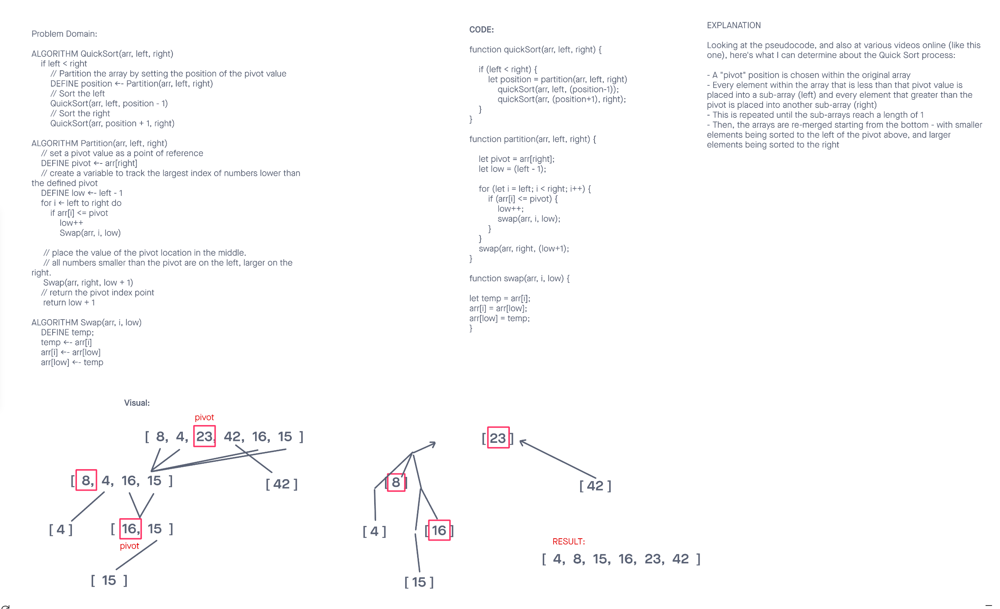
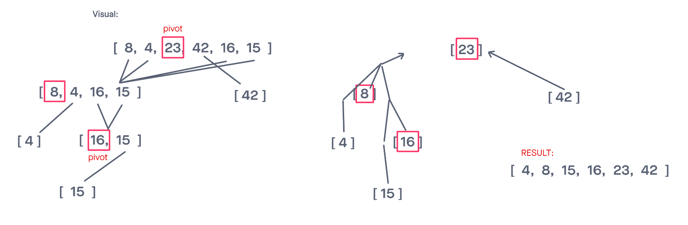
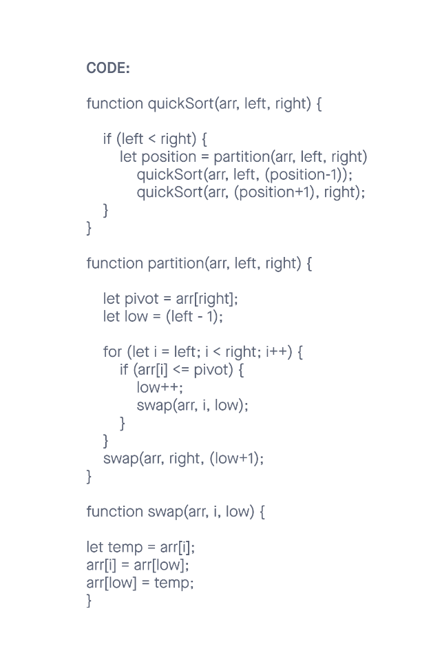

# Challenge Summary

Review the pseudocode below, then trace the algorithm by stepping through the process with the provided sample array. Document your explanation by creating a blog article that shows the step-by-step output after each iteration through some sort of visual.

Once you are done with your article, code a working, tested implementation of Merge Sort based on the pseudocode provided.

## Whiteboard Process



## Blog Article

Reading, writing, and comprehending pseudocode is an important skill for a developer to build. This skill allows a developer to work in languages they may not be as familiar with. It also helps to conceptualize the solution to a problem before jumping into the code. This slows the thought process a bit and forces the developer to think about the problem (instead of the code) first and foremost.

In the example below, we are giving some pseudocode and asked to step through the solution first. By doing this, we determine our algorithm. And once we've confirmed the algorithm is sound, we can proceed to actually writing the code.

### Problem Domain

Review the pseudocode below, then trace the algorithm by stepping through the process with the provided sample array. Document your explanation by creating a blog article that shows the step-by-step output after each iteration through some sort of visual.

Once you are done with your article, code a working, tested implementation of Insertion Sort based on the pseudocode provided.

### Pseudocode

```
ALGORITHM QuickSort(arr, left, right)
    if left < right
        // Partition the array by setting the position of the pivot value
        DEFINE position <-- Partition(arr, left, right)
        // Sort the left
        QuickSort(arr, left, position - 1)
        // Sort the right
        QuickSort(arr, position + 1, right)

ALGORITHM Partition(arr, left, right)
    // set a pivot value as a point of reference
    DEFINE pivot <-- arr[right]
    // create a variable to track the largest index of numbers lower than the defined pivot
    DEFINE low <-- left - 1
    for i <- left to right do
        if arr[i] <= pivot
            low++
            Swap(arr, i, low)

     // place the value of the pivot location in the middle.
     // all numbers smaller than the pivot are on the left, larger on the right.
     Swap(arr, right, low + 1)
    // return the pivot index point
     return low + 1

ALGORITHM Swap(arr, i, low)
    DEFINE temp;
    temp <-- arr[i]
    arr[i] <-- arr[low]
    arr[low] <-- temp
```

### Sample Arrays

In your blog article, visually show the output of processing this input array:

`[8,4,23,42,16,15]`

For your own understanding, consider also stepping through these inputs:

Reverse-sorted: `[20,18,12,8,5,-2]`
Few uniques: `[5,12,7,5,5,7]`
Nearly-sorted: `[2,3,5,7,13,11]`

### Implementation

Provide a visual step through for each of the sample arrays based on the provided pseudo code
Convert the pseudo-code into working code in your language
Present a complete set of working tests

### Solution

Taking the input array: `[4, 6, 3, 2, 10, 19, 1, 8]`



My attempt at explaining the process based on the pseudocode/algorithms provided and primarily [this video](https://www.youtube.com/watch?v=XE4VP_8Y0BU&t=0s):

- A "pivot" position is chosen within the original array

- Every element within the array that is less than that pivot value is placed into a sub-array (left) and every element that greater than the pivot is placed into another sub-array (right)

- This is repeated until the sub-arrays reach a length of 1

- Then, the arrays are re-merged starting from the bottom - with smaller elements being sorted to the left of the pivot above, and larger elements being sorted to the right

Upon confirming the steps are correct, we can then proceed to write our code:


