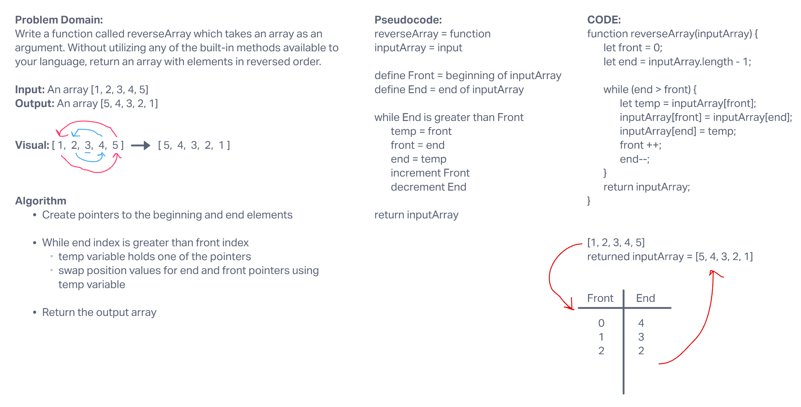

# Reverse an Array

Write a function called reverseArray which takes an array as an argument. Without utilizing any of the built-in methods available to your language, return an array with elements in reversed order.

## Whiteboard Process

## Approach & Efficiency

We walked through this example in class, so it was pretty straightforward. But as I re-wrote it I thought through each step to make sure I understood what was happening.
