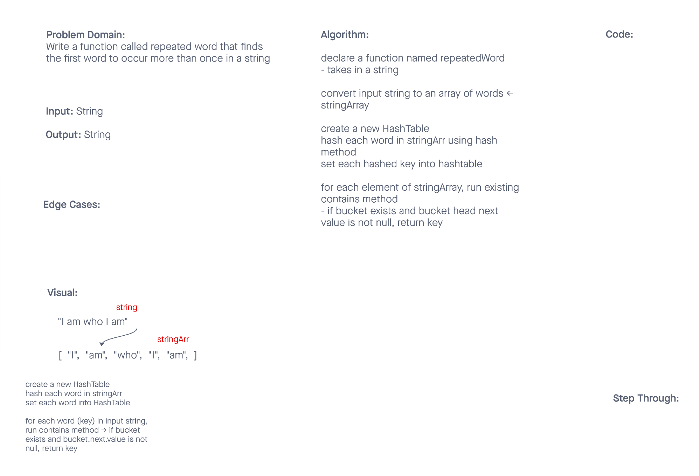

# Hashtables

A **hash table** is a data structure that provides the ability to store a key and quickly retrieve a value. Hashing is the ability to encode the key. They key points to a location in the data structure that holds the value we want to retrieve.

**Hash mapping** is the method for finding the information that is stored at that key location. These data structures make use of an array's O(1) read access (vs. iterating through the entire data structure) because the data is stored at a specific index location.

## Challenge

Implement a Hashtable Class with the following methods:

**set**

- Arguments: *key, value*
- Returns: *nothing*
- This method should hash the key, and set the key and value pair in the table, handling collisions as needed
- Should a given key already exist, replace its value from the value argument given to this method

**get**

- Arguments: *key*
- Returns: *Value associated with that key in the table*

**contains**

- Arguments: *key*
- Returns: *Boolean, indicating if the key exists in the table already*

**keys**

- Returns: *Collection of keys*

**hash**

- Arguments: *key*
- Returns: *Index in the collection for that keyDescription of the challenge*

## Approach & Efficiency
<!-- What approach did you take? Why? What is the Big O space/time for this approach? -->

## API
<!-- Description of each method publicly available in each of your hashtable -->
----------------------------

## Code Challenge: Class 31

Find the first repeated word in a book.

- Write a function called repeated word that finds the first word to occur more than once in a string
  - Arguments: string
  - Return: string

Examples:

- Input: `"Once upon a time, there was a brave princess who..."`
- Output: `"a"`

-----------------------------

- Input: `"It was the best of times, it was the worst of times, it was the age of wisdom, it was the age of foolishness, it was the epoch of belief, it was the epoch of incredulity, it was the season of Light, it was the season of Darkness, it was the spring of hope, it was the winter of despair, we had everything before us, we had nothing before us, we were all going direct to Heaven, we were all going direct the other way – in short, the period was so far like the present period, that some of its noisiest authorities insisted on its being received, for good or for evil, in the superlative degree of comparison only..."`
- Output: `"it"`

-----------------------------

- Input: `"It was a queer, sultry summer, the summer they electrocuted the Rosenbergs, and I didn’t know what I was doing in New York..."`
- Output: `"summer"`

## Whiteboard



----------------------------

## Code Challenge: Class 33

Implement a simplified LEFT JOIN for 2 Hashmaps

Write a function that LEFT JOINs two hashmaps into a single data structure.

- Write a function called left join
- Arguments: two hash maps
  - The first parameter is a hashmap that has word strings as keys, and a synonym of the key as values.
  - The second parameter is a hashmap that has word strings as keys, and antonyms of the key as values.
- Return: The returned data structure that holds the results is up to you. It doesn’t need to exactly match the output below, so long as it achieves the LEFT JOIN logic

NOTES:

- Combine the key and corresponding values (if they exist) into a new data structure according to LEFT JOIN logic.
- LEFT JOIN means all the values in the first hashmap are returned, and if values exist in the “right” hashmap, they are appended to the result row.
- If no values exist in the right hashmap, then some flavor of `NULL` should be appended to the result row.

## Algorithm

```javascript

// create arrays that will be used to populate 2 hashtables, using example keys and values

firstArray = [
  ["font", "enamored"],
  ["wrath", "anger"],
  ["diligent", "employed"],
  ["outfit", "garb"],
  ["guide", "usher"]
]

secondArray = [
  ["font", "averse"],
  ["wrath", "delight"],
  ["diligent", "idle"],
  ["flow", "jam"],
  ["guide", "follow"]
]


// create 2 seperate hashtables using existing HashTable class

create a new HashTable from existing class <- hashtable1
iterate over firstArray, for each array inside it, run hashtable.set method -> placing it into hashtable1
repeat with secondArray to create hashtable2

// function:

define a function called leftJoin, that takes in 2 hashtables (created above)
define a blank array variable <- returnArray
run keys method to get a collection of keys (array), set to variable <- keys
iterate through keys array and for each element (key), run get method on hashtable1 <- set key + returned value into returnArray

iterate through keys array and for each element, run get method on hashtable2 <- push returned value into returnArray on the appropriate existing array
iterate through returnArray
returned value gets compared to returnArray[i][0]
if matches, push returned value into that array <- which is an element inside returnArray

```
