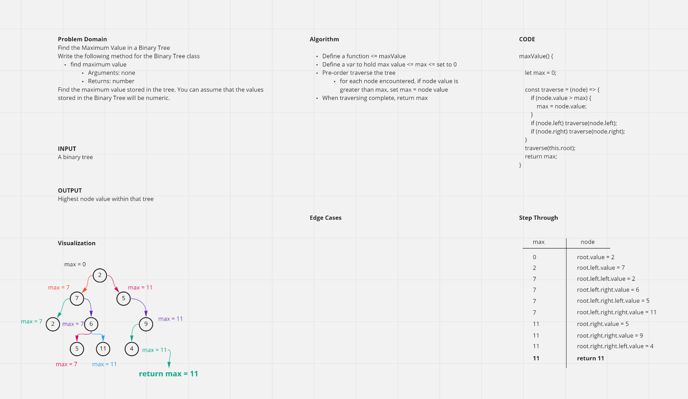

# Binary Tree and BST Implementation
<!-- Short summary or background information -->

## Challenge

- Challenge Type: New Implementation

### Node

- Create a Node class that has properties for the value stored in the node, the left child node, and the right child node.

### Binary Tree

- Create a Binary Tree class
- Define a method for each of the depth first traversals:
  - pre order
  - in order
  - post order which returns an array of the values, ordered appropriately.

### Binary Search Tree

- Create a Binary Search Tree class
  - This class should be a sub-class (or your languages equivalent) of the Binary Tree Class, with the following additional methods:
- **Add**
  - Arguments: value
  - Return: nothing
  - Adds a new node with that value in the correct location in the binary search tree.
- **Contains**
  - Argument: value
  - Returns: boolean indicating whether or not the value is in the tree at least once.

## Approach & Efficiency

- Relied heavily on [this article](https://medium.com/swlh/binary-search-tree-in-javascript-31cb74d8263b#:~:text=To%20insert%20a%20node%20to,add%20the%20new%20node%20as) for proper syntax of class methods

------------------------------------------------------------

## Find the Maximum Value in a Binary Tree

### Challenge 16

- Challenge Type: Extending an Implementation

### Write the following method for the Binary Tree class

- find maximum value
  - Arguments: none
  - Returns: number
- Find the maximum value stored in the tree. You can assume that the values stored in the Binary Tree will be numeric.

### Algorithm

- Define a function <= maxValue
- Define a var to hold max value <= max <= set to 0
- Pre-order traverse the tree
  - for each node encountered, if node value is greater than max, set max = node value
- When traversing complete, return max

### Whiteboard

