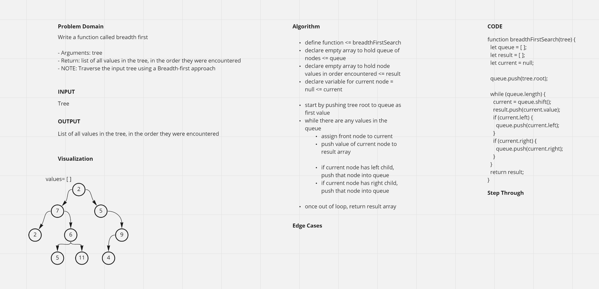
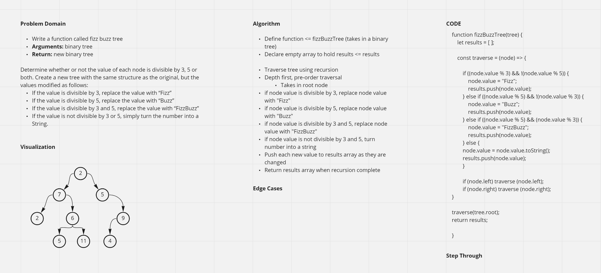

# Binary Tree and BST Implementation
<!-- Short summary or background information -->

## Challenge

- Challenge Type: New Implementation

### Node

- Create a Node class that has properties for the value stored in the node, the left child node, and the right child node.

### Binary Tree

- Create a Binary Tree class
- Define a method for each of the depth first traversals:
  - pre order
  - in order
  - post order which returns an array of the values, ordered appropriately.

### Binary Search Tree

- Create a Binary Search Tree class
  - This class should be a sub-class (or your languages equivalent) of the Binary Tree Class, with the following additional methods:
- **Add**
  - Arguments: value
  - Return: nothing
  - Adds a new node with that value in the correct location in the binary search tree.
- **Contains**
  - Argument: value
  - Returns: boolean indicating whether or not the value is in the tree at least once.

## Approach & Efficiency

- Relied heavily on [this article](https://medium.com/swlh/binary-search-tree-in-javascript-31cb74d8263b#:~:text=To%20insert%20a%20node%20to,add%20the%20new%20node%20as) for proper syntax of class methods

------------------------------------------------------------

## Find the Maximum Value in a Binary Tree

### Challenge 16

- Challenge Type: Extending an Implementation

### Write the following method for the Binary Tree class

- find maximum value
  - Arguments: none
  - Returns: number
- Find the maximum value stored in the tree. You can assume that the values stored in the Binary Tree will be numeric.

### Algorithm

- Define a function <= maxValue
- Define a var to hold max value <= max <= set to 0
- Pre-order traverse the tree
  - for each node encountered, if node value is greater than max, set max = node value
- When traversing complete, return max

### Whiteboard

------------------------------------------------------------

## Breadth-first Traversal

### Challenge 17

- Challenge Type: Code Challenge / Algorithm

### Write a function called breadth first

- Arguments: tree
- Return: list of all values in the tree, in the order they were encountered
- NOTE: Traverse the input tree using a Breadth-first approach

### Algorithm

Relied heavily on [this article](https://javascript.plainenglish.io/tree-traversal-in-javascript-9b1e92e15abb) for correct syntax and understanding of breadth-first traversal while writing this code.

define function <= breadthFirstSearch
declare empty array to hold queue of nodes <= queue
declare empty array to hold node values in order encountered <= result
declare variable for current node = null <= current

start by pushing tree root to queue as first value
while there are any values in the queue
assign front node to current
push value of current node to result array

if current node has left child, push that node into queue
if current node has right child, push that node into queue

once out of loop, return result array

### Whiteboard

------------------------------------------------------------

## FizzBuzz

### Challenge 18

- Conduct “FizzBuzz” on a binary tree while traversing through it to create a new tree.

- Set the values of each of the new nodes depending on the corresponding node value in the source tree.

## Feature Tasks

- Write a function called fizz buzz tree
- Arguments: binary tree
- Return: new binary tree

Determine whether or not the value of each node is divisible by 3, 5 or both. Create a new tree with the same structure as the original, but the values modified as follows:

- If the value is divisible by 3, replace the value with “Fizz”
- If the value is divisible by 5, replace the value with “Buzz”
- If the value is divisible by 3 and 5, replace the value with “FizzBuzz”
- If the value is not divisible by 3 or 5, simply turn the number into a String.

### Algorithm

Define function <= fizzBuzzTree (takes in a binary tree)
Declare empty array to hold results <= results

Traverse tree using recursion
Depth first, pre-order traversal
Takes in root node
if node value is divisible by 3, replace node value with "Fizz"
if node value is divisible by 5, replace node value with "Buzz"
if node value is divisible by 3 and 5, replace node value with "FizzBuzz"
if node value is not divisible by 3 and 5, turn number into a string
Push each new value to results array as they are changed
Return results array when recursion complete

### Whiteboard

